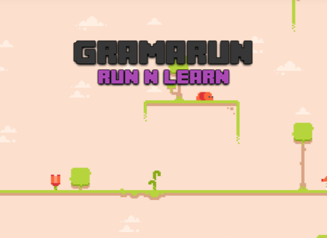

<h1 align="center">
   
  
   
</h1>

<h4 align="center">
  Projet SAE du Semestre 3, IUT AIX BUT INFO  
</h4>

 
  

## Description

Ce site a été créé dans le cadre de la SAE qui avait pour but de créer un "jeu sérieux" pour différents sujets. Le jeu créé dans ce projet est axé sur l'apprentissage de l'anglais. Il vous permettra de réviser vos cours pour vos prochains examens tout en améliorant votre niveau d'anglais général.
## Prérequis

### Modules python nécessaires 🐍

- pip install flask
- pip install flask_sqlalchemy
- pip install flask_login
- pip install mysql_connector
- pip install flask_table
- pip install requests
- pip install dotenv
- pip install itsdangerous
- pip install flask_cors

### Bibliothèque nécessaire pour les tests Jest 🧪
Installation de NodeJS (Windows & MacOS) :
- https://nodejs.org/fr/download

🐧 Linux :
- sudo apt-get install nodejs npm

Puis se mettre dans le répertoire de test et y rentrer :
- npm install --save-dev jest

Pour lancer les tests il faut se mettre dans votre répertoire de test :
- npm test

Recommandation d'extension pour lancer depuis une interface graphique les tests (Jest Runner) :
 - https://marketplace.visualstudio.com/items?itemName=firsttris.vscode-jest-runner

## Contributeur ✨

Personnes ayant participé a ce projet

<table >
  <td align="center">
  <a href="https://github.com/GonzalesAndy">
      
    
      <b>Gonzales Andy</b>
    
  </a>
     
      💅
    </a>
  </td>
  
  <td align="center">
  <a href="https://github.com/Antonin-Goudezeune">
      
    
      <b>Goudezeune Antonin</b>
    
  </a>
     
      🧸
    </a>
  </td>
  
  <td align="center">
  <a href="https://github.com/AntLafI">
      
    
      <b>Lafitte Antoine</b>
    
  </a>
     
      🐉
    </a>
  </td>
  
  <td align="center">
  <a href="https://github.com/Yanis-TRIGLIA">
      
    
      <b>Triglia Yanis</b>
    
  </a>
     
      🤯
    </a>
  </td>
  
  <td align="center">
  <a href="https://github.com/EliseeLeydier">
      
    
      <b>Leydier Elisée</b>
    
  </a>
     
      😏
    </a>
  </td>
  
</table>
    
